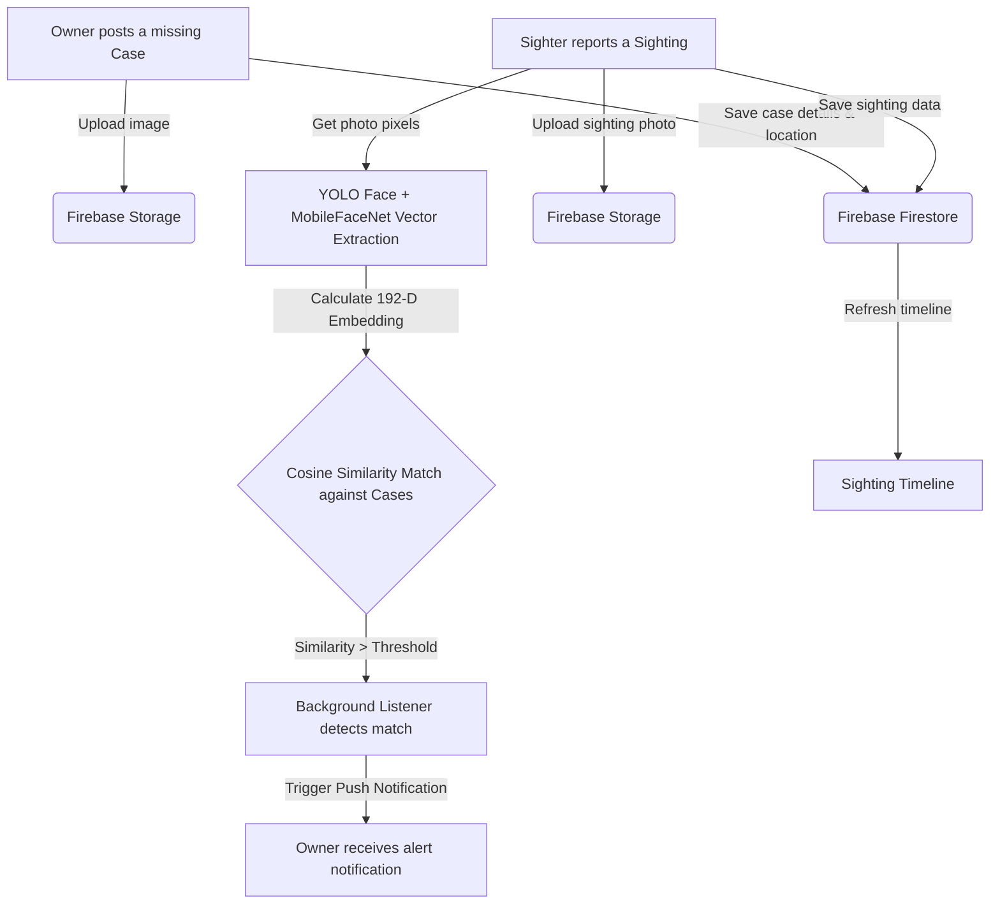

# 🔍 Lost & Found — Intelligent Lost/Found & Facial Recognition System

This is an intelligent Lost & Found and Missing Persons/Pets Tracking System built using **Android (Kotlin + Jetpack Compose)**. In addition to standard loss reporting and map-based check-ins, the application leverages **TensorFlow Lite (YoloFace + MobileFaceNet)** machine learning models for facial embedding comparison, paired with **Firebase** cloud services for data management and real-time alerts.

---

## 🚀 Teacher's Guide: Direct APK Download & Run

To help you easily evaluate and run the project, a pre-compiled **APK installer** is placed directly at the root directory of this repository:

> 📥 **Direct APK Download**: 👉 **[LostFound.apk](./LostFound.apk)** 👈
>
> *Tip: On the GitHub page, you can simply click the `LostFound.apk` link above, click the **Download** button to download the file, and then install it on an Android physical device (recommended) or an Android Studio Emulator to run it instantly.*

---

## ✨ Core Features

- 🧑‍🤝‍🧑 **Intelligent Face Detection & Matching (ML Face Match)**
  - Uses **YOLO Face Detector** to localize human faces in uploaded images.
  - Uses **MobileFaceNet** to extract a 192-dimensional facial feature vector (Embedding).
  - When a user uploads a sighting, the system automatically computes the cosine similarity between the sighting's face and all active missing cases in the database to identify potential matches.
- ☁️ **Full-stack Firebase Integration**
  - **Firebase Auth**: Secure email/password login, registration, and profile setup.
  - **Firebase Firestore**: Real-time cloud database to synchronize "Cases" and "Sightings". Configured with offline persistence caching so users can view data without network connectivity.
  - **Firebase Storage**: Secure binary object storage for high-quality photos of lost items, pets, or missing people.
- 🗺️ **Interactive Location Tracking (Google Maps Integration)**
  - Uses the **Google Maps SDK for Android (Maps Compose)** to plot the exact locations of the loss and subsequent sightings on an interactive map.
  - Helps users visualize paths, locate where their items were last seen, and track search areas.
- 📈 **Sighting Progress Timeline**
  - Each missing case comes with a comprehensive timeline showing all user-submitted sightings (with photo, location, similarity score, and timestamp) in chronological order.
- 🔔 **Real-Time Notification Alerts**
  - Whenever a sighting is reported with a high facial similarity match to a user's missing case, a background service triggers a system notification on the owner's device.

---

## 🏗️ Architecture & Data Flow

Below is the diagram representing the system architecture and how data flows through the application:



---

## 🛠️ Tech Stack

| Module | Technologies / Libraries | Description |
| :--- | :--- | :--- |
| **Language** | Kotlin 1.9+ | Modern, type-safe official language for Android development |
| **UI Framework** | Jetpack Compose (Material 3) | Declarative UI toolkit supporting smooth transitions and reactive layouts |
| **Concurrency** | Kotlin Coroutines & Flow | Asynchronous programming for network requests and heavy ML processing |
| **Machine Learning** | TensorFlow Lite + ML Kit | YOLO Face detection and MobileFaceNet facial recognition models |
| **Cloud Services** | Firebase (Auth / Firestore / Storage) | Secure user auth, real-time database with offline support, and image hosting |
| **Maps & Location** | Google Maps SDK + Location Services | High-accuracy location fetching and interactive map markers |
| **Image Loading** | Coil Compose | Lightweight asynchronous image loading library optimized for Jetpack Compose |

---

## 💻 Local Development & Build Guide

If you want to open the project in Android Studio or compile it from source code locally, please follow the steps below.

### 1. Prerequisites
* **JDK Version**: Java 17 (Recommended version bundled with Android Studio).
* **Android SDK**: API Level 24 (Android 7.0) minimum, Target SDK 36 (Android 14).
* **IDE**: Android Studio Jellyfish / Koala or newer.

### 2. Configuration Keys
For an out-of-the-box experience:
* **Google Maps API Key**: A test key is pre-configured in `app/src/main/AndroidManifest.xml` to load map tiles directly.
* **Firebase config**: A test configuration file (`app/google-services.json`) is already included to connect to the developer test database.

> *💡 Note: If you want to deploy this in a production environment, please generate your own Google Maps Key and download your personal `google-services.json` from the Firebase Console, placing it in the `app/` folder.*

### 3. Run via Android Studio
1. Open Android Studio and click **File -> Open**.
2. Select the project's root folder and wait for Gradle Sync to finish.
3. Enable USB debugging on your Android physical device or start an emulator.
4. Click the green **Run (Play)** button in the toolbar.

### 4. Build via Command Line (Gradle CLI)
You can compile the project using the Gradle Wrapper.

* **To compile and generate Debug APK**:
  ```bash
  # Windows (PowerShell / Command Prompt)
  .\gradlew.bat assembleDebug

  # macOS / Linux
  ./gradlew assembleDebug
  ```
  The generated APK will be placed at: `app/build/outputs/apk/debug/app-debug.apk`.

* **To install directly onto a connected device**:
  ```bash
  # Windows
  .\gradlew.bat installDebug

  # macOS / Linux
  ./gradlew installDebug
  ```
